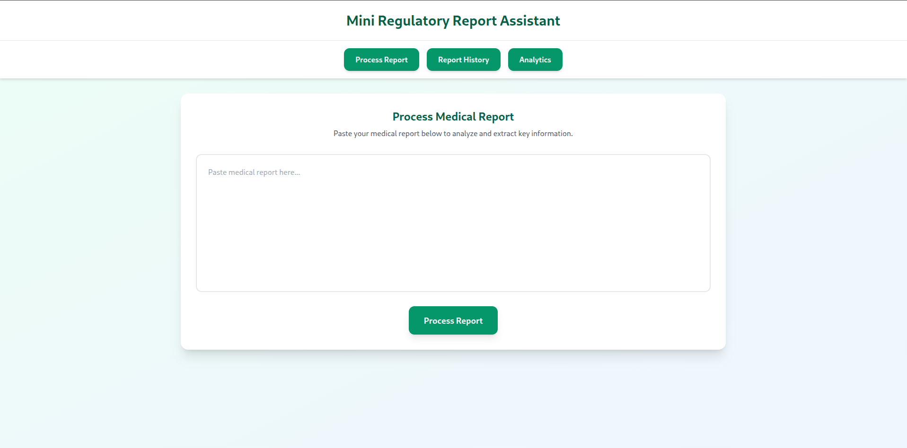
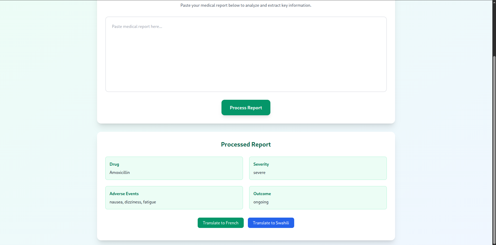
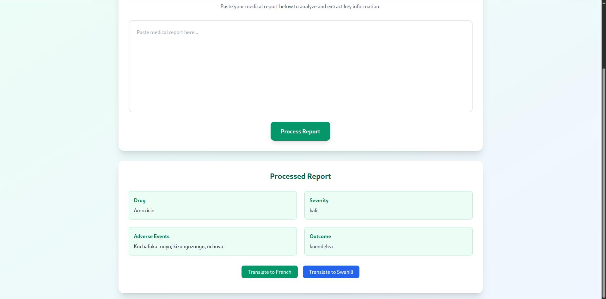
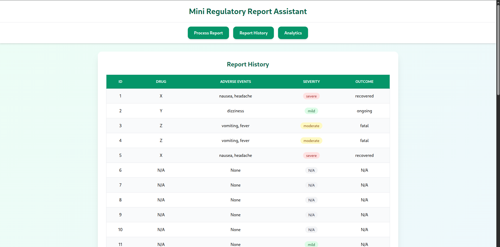
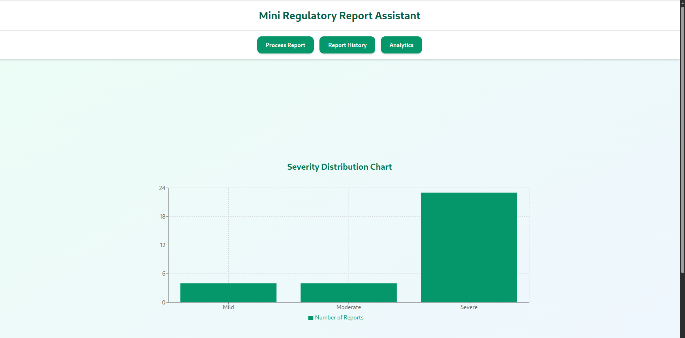

# Mini Regulatory Report Assistant

A full-stack AI tool that automates the extraction of structured information from medical reports, providing insights such as drugs used, adverse events, severity, and patient outcomes. The system also supports optional translation of outcomes into French and Swahili.

---

## Project Overview

The Mini Regulatory Report Assistant allows users to:

- Detect **drugs** mentioned in a medical report.
- Identify **adverse events** experienced by patients.
- Classify **severity** (mild, moderate, severe).
- Determine **outcome** (recovered, ongoing, fatal).
- Save reports in a **database** for history tracking.
- Optionally translate outcomes into **French** or **Swahili**.

The project integrates **rule-based extraction** and **Hugging Face NLP models** in a FastAPI backend with a **React + Tailwind CSS frontend**.

---


## Features

### Backend
### Backend

- **POST `/process-report`** – Extracts structured data (drug, adverse events, severity, outcome) from a medical report and saves it to the database.  
- **POST `/translate`** – Translates all fields of a processed report into French (`fr`) or Swahili (`sw`).  
- **GET `/reports`** – Retrieves all processed reports from the database.  
- **Hugging Face NER** – Detects drugs, chemicals, diseases, and symptoms for accurate extraction.  
- **Rule-based Fallback** – Uses regex and keyword rules to detect drugs, adverse events, severity, and outcome if NER fails.  

### Frontend
- **Input Form**: Paste medical reports for processing.
- **Results Display**: View extracted data (drug, adverse events, severity, outcome).
- **Responsive UI** with Tailwind CSS.
- **Additional Features**: Translate outcome, view history, simple charts.

---

## Installation & Setup

### Backend

```bash
# Navigate to backend folder
cd backend

# Create a virtual environment
python -m venv venv

# Activate the virtual environment
# Linux/macOS
source venv/bin/activate
# Windows
venv\Scripts\activate

# Install Python dependencies
pip install -r requirements.txt

# Run the FastAPI server
uvicorn main:app --reload 

```

### Frontend
```bash
# Navigate to frontend folder
cd frontend

# Install Node dependencies
npm install

# Start the development server
npm run dev
```
Open your browser at http://localhost:5173 to use the app.


## Usage

Paste a medical report into the text area.

Click Process Report.

View extracted data below the form.

Optional:

Click French or Swahili to see translations in French or Swahili.

View report history or charts by clicking the buttons on the navbar

## 📸 Screenshots
Below are a sample screenshots of the system.
### Main Page


### Processed Report English


### Processed Report French


### Processed Report Swahili


### Report History


### Severity Chart



## Future Improvements

Use domain-specific medical NER models from Hugging Face for higher accuracy.

Add full multi-language support for all extracted fields.

Integrate charts and analytics to visualize severity and outcomes.

Deploy the project live on Heroku, Vercel, or similar platforms.